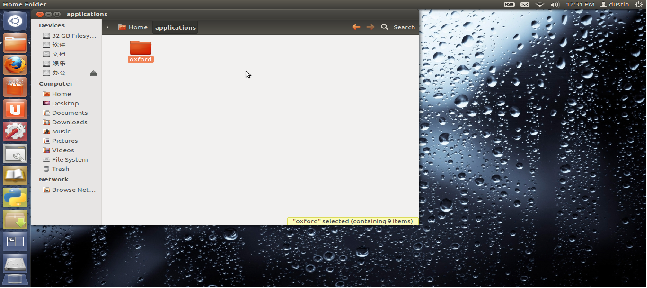
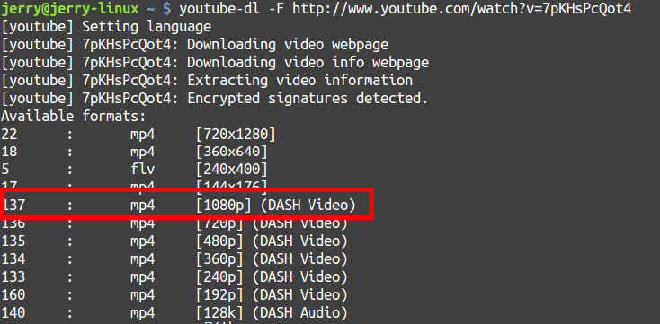
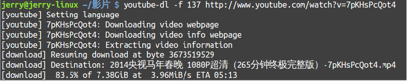

# 安装必备的应用软件
## 安装及配置Chrome浏览器
(1) 添加chrome的源:

```
sudo vim /etc/apt/menu.lst
```

(2) 添加如下源到文件menu.lst:

```
deb http://ppa.launchpad.net/fta/ppa/ubuntu karmic main
deb-src http://ppa.launchpad.net/fta/ppa/ubuntu karmic main
```

(3) 导入密钥:

```
gpg --keyserver keyserver.ubuntu.com --recv 0c713da6
gpg --export --armor 0c713da6 | sudo apt-key add -
```

(4) 更新源:

```
sudo apt-get update
```

(5) 安装:

```
sudo apt-get install chromium-browser
```

此时，chrome浏览器安装完成，但flash仍然无法播放，需要安装flashplayer插件。

(6) 如果系统还没安装flashplayer plugin，先安装其：

```
sudo apt-get install flashplugin-installer
```

(7) 将插件拷贝到chrome插件的目录下：

```
sudo cp /usr/lib/flashplugin-installer/libflashplayer.so /usr/lib/chromium-browser/plugins/
```

(8) 设置chrome启动时加载插件，修改快捷方式的启动命令为：

```
sudo chromium-browser %U --enable-extensions --enable-plugins
```

(9) 此时，可以播放flash来，但遇到中文字符是乱码，解决方案如下：

```
sudo vim /etc/fonts/conf.d/49-sansserif.conf
```

将edit标签下的sans-serif修改为sans，保存并退出。

(10) Chrome下载文件名出现乱码解决办法：

扳手->Settings（设置）->ShowAdvance Settings（显示高级设置）->Web Content（网页内容）->Customizefonts（自定义字体）->Encoding（编码）->会发现默认设置的是ISO-8859-1->现在把它设置成Chinese Simplified(GBK)（中文简体 GBK）->你也可以设置自己喜欢的字体->问题解决。

## 安装Adobe Reader
(1)双击下载的安装文件即可完成安装.

(2)添加中文支持：

下载font pack包并解压，在目录中运行

```
sudo sh ./INSTALL
```

按提示操作，注意Acrobat Reader 9的安装目录是/opt/Adobe,在输入该目录时只需要输入/opt即可。安装非常简易。安装完成以后便可以打开中文文档。
		
(3)解决PDF阅读器的乱码问题.

## 安装China Union 3G驱动

## 安装EIOffice

## 安装ibus
(1) 只需要打开console，输入ibus-daemon -x -r -d就行.

(2) 将ibus设置为默认输输入法:

```
 im-switch -s ibus -z default
```

(3) 设置为默认启动: 系统设置-高级-自动启动，添加程序，输入ibus-daemon -x -r -d，确定，最后注销重登。

(4) 如果输入法没有输入框，请检查是否已经安装了python-notify包：

```
sudo apt-get install python-notify
```

然后注销重新进入即可。

## 安装INode软件
(1) 追加可执行权限：

```
sudo chmod –R 777 iNodeClient
```

(2) 安装软件：

```
sudo ./install.sh
```

(3) 对于ubuntu 12.04还需要安装以下软件:

```
# ln –s /usr/lib/i386-linux-gnu/libtiff.so.4 /usr/lib/i386-linux-gnu/libtiff.so.3
# apt-get install libjpeg62
```

## 安装Picasa

## 安装ppstream

## 安装牛津高阶词典

1:下载词典

下载地址：http://www.verycd.com/topics/2808053/。

2：提取文件：

在windows下建立一个新的文件夹oxford，然后将oald8.iso文件用虚拟光驱以文件形式的打开，打开后将里面的文件都复制的新建的oxford中。

3：启动ubuntu系统：

在windows下建立一个新的文件夹oxford，然后将oald8.iso文件用虚拟光驱以文件形式的打开，打开后将里面的文件都复制的新建的oxford中。如下图所示：



<center>安装词典</center>


双击oxford文件夹，然后在打开linux文件夹，发现里面有一个setup.sh，右击setup.sh选择属性，点击权限设置，选择Allow excuting file as program。

4：安装牛津高阶英语词典：

Alt+Ctrl+T打开终端，用cd命令打开setup.sh所在的文件夹。然后输入 ./setup.sh即可。

5:安装过程设置：

安装的过程可以自己设置安装路径，也可按照软件提供的路径。要是选择第二种话，安装过程一直按'回车'就可以的。

6：启动快捷方式设置:

并不是安装结束后，这个软件就可以运行了，还需要下面关键两个步骤！

1：启动设置：

将快捷方式设置成可执行程序，否则在双击这个快捷方式，是不能执行的， 所以也就不能启动oald8软件了。右击桌面快捷方式，选择属性，权限设置，将这个快捷方式设置成可执行程序。

2：词典发音设置：

若是没有这步骤，词典是不可发音的，具体过程如下：

command设置，这个也是很关键一步，若是不设置这个command，这个软件是不能发音的。同样是右击桌面的快捷方式，选择属性，你会发现有command里写着的是：home/dustin/oald8//oald8将其改为如下命令：padsp '/home/dustin/oald8//oald8'，这个命令要根据安装路径的不同还有用户名字而定，写一个通用的命令吧，自己要根据自己的用户名，还有安装路径自己设置吧padsp '/home/用户名字/安装路径//oald8'. 最后大家就可以使用这个很棒的牛津词典了，perfect！

## 安装Dropbox

1. Add Dropbox’s repository key:

```
sudo apt-key adv --keyserver pgp.mit.edu --recv-keys 5044912E
```

2. Add Dropbox’s repository:

```
sudo add-apt-repository "deb http://linux.dropbox.com/ubuntu $(lsb_release -sc) main
```

3. update and install Dropbox:

```
sudo apt-get update
sudo apt-get install dropbox nautilus-dropbox
```

4. Follow the steps When dropbox prompted with the screen.

## 安装Skype

```
sudo apt-add-repository "deb http://archive.canonical.com/ $(lsb_release -sc) partner"
sudo apt-get update && sudo apt-get install skype
```

## 安装图片编辑工具gimp

```
sudo apt-get install gimp
```

## 安装电驴下载软件amule

```
sudo apt-get install amule
```

## smaplyer

```
sudo apt-get install smplayer subdownloader
```

播放文件时标题栏经常会出现乱码，解决办法: 首选项—>高级—>在窗口标题上显示标签信息这一项去掉，smplayer标题栏显示的就是你的文件名了。

## ubuntu one

## 下载youtube视频
(1) 用下列指令安裝youtube-dl:

```
sudo apt-get install youtube-dl
```

(2) 用瀏覽器瀏覽http://youtube.com，搜尋到需要的影片後複製其網址，輸入下列指令先找出能下載的影片格式，我打算下載成1080p的高清格式，因此格式代碼是137（後記：137、136下載的檔案都無法播放，改用22就可以）：

```
youtube-dl -F http://www.youtube.com/watch?v=7pKHsPcQot4
```


<center>youtube可用参数</center>

(3) 以-f 137下載成1080p的格式：

```
youtube-dl -f 137 http://www.youtube.com/watch?v=7pKHsPcQot4
```



<center>youtube使用举例</center>

## 一个Linux脚本搞定常用软件的安装

```
#Bittorrent
sudo apt-get remove bittorrent -y
#安装StarDict翻译词典
sudo apt-get install stardict stardict-common  --force-yes -y
sudo apt-get install stardict-cdict-gb stardict-cedict-gb stardict-hanzim stardict-langdao-ce-gb stardict-langdao-ec-gb stardict-oxford-gb stardict-xdict-ce-gb stardict-xdict-ec-gb  --force-yes -y
#安装浏览器Flash插件：
sudo mkdir -p /usr/lib/X11/fonts/Type1
sudo apt-get install flashplugin-nonfree --force-yes -y
#安装FTP工具
sudo apt-get install gftp --force-yes -y
#安装进入终端的右键快捷菜单
sudo apt-get install nautilus-open-terminal --force-yes -y
#alien--把rpm包转换成deb包。使用命令：alien abc.rpm
sudo apt-get install alien --force-yes -y
#安装视频播放软件和相应解码器
sudo apt-get install mplayer mozilla-mplayer libxine-extracodecs w32codecs --force-yes -y
sudo apt-get install gstreamer0.10-plugins-ugly gstreamer0.10-pitfdll gstreamer0.10-ffmpeg --force-yes -y
sudo apt-get install im-switch fcitx libapt-pkg-perl --force-yes -y
#切换输入法
sudo im-switch -s fcitx
#阅读CHM文件，chmsee对某些不规范的chm文件支持效好， gnochm支持搜索
sudo apt-get install chmsee gnochm --force-yes -y
#桌面搜索，功能类似于GOOGLE的那个桌面搜索。安装后在“附件”菜单可找到一个“搜索”项
sudo apt-get install beagle --force-yes -y
sudo apt-get install gnuplot vim automake autoconf  gwenview kchmviewer alien nautilus-open-terminal
```

## 安装压缩解压缩

```
sudo apt-get install unace unrar zip unzip p7zip-full p7zip-rar sharutils rar uudeview mpack lha arj cabextract
```

## 安装vlc视频播放器
(1) 音视频播放:

```
sudo apt-get install vlc
```

(2) 安装编解码器：

```
sudo apt-get install non-free-codecs libxine1-ffmpeg gxine mencoder libmpcdec3 libquicktime1 flac faac faad sox ffmpeg2theora libmpeg2-4 uudeview flac libmpeg3-1 mpeg3-utils mpegdemux liba52-dev mpeg2dec vorbis-tools id3v2 mpg321 mpg123 libflac++6 ffmpeg libmp4v2-0 totem-mozilla icedax tagtool easytag id3tool lame nautilus-script-audio-convert libmad0 libjpeg-progs
```

## 安装WPS办公软件
(1) 将下载的WPS和symbol font的deb文件双击安装即可。

(2) 将下载的字体文件解压缩到~/.fonts目录即可解决字体丢失问题。

(3) libreOffice没有必要保留：

```
sudo apt-get remove unity-webapps-common
sudo apt autoremove
```

## 修改系统的默认字体
(1) 左键点击右上角的齿轮,找到其中的系统设置选项.

(2) 点击universal access, 在contrast下拉列表中选择small即可.

## 修改系统输入法
(1) 按一下windows键然后在出现的对话框中输入keyboard命令并找到图标点击.

(2) 点击OK后出现的对话框中运行相应的设置即可.

(3) 添加五笔输入法:

```
sudo apt-get install ibus-table-wubi
```

(4) 点击右上角的齿轮,选择startup applications.在弹出来的对话框的command里填写/usr/bin/ibus-daemon –d, Name和commer可乱写.

## BT下载工具

```
sudo apt-get install deluge
```

## 系统配置工具
(1) 安装编辑器配置工具

```
sudo apt-get install myunity gconf-editor dconf-tools
```

(2) 安装ubuntu-tweak

```
# apt-add-repository ppa:tualatrix/ppa

# apt-get update

# apt-get install ubuntu-tweak
```

## 安装QQ软件
(1) 安装QQ软件:

```
sudo dpkg –I WineQQ2013.deb
```

(2) 配置ibus输入法:

在/etc/profile文件最后添加

```
XMODIFIERS="@im=ibus"
XIM="ibus"
GTK_IM_MODULE="xim"
QT_IM_MODULE="xim"
ibus-daemon -d –x
把/etc/X11/xinit/xinput.d/ibus 文件中的 XIM_ARGS="--xim" 改成XIM_ARGS="-d -x"
```

## 安装dock工具

```
sudo apt-get install docky cairo-dock conky screenlets
```

## gmail邮件通知工具

```
sudo apt-get install gm-notify
```

## Liberoffice的美化工具

```
sudo apt-get install lo-menubar
```

## 解除gedit乱码

(1) apt-get install dconf-tools;

(2) 在终端输入dconf-editor;

(3) 找到org-gnome-gedit-preferences-encodings在其中UTF-8前面添加’GBK’就可以了.

也可以命令行下输入：

```
gsettings set org.gnome.gedit.preferences.encodings \
auto-detected "['UTF-8','GB18030','GB2312','GBK','BIG5','CURRENT','UTF-16']"
```

## 安装assaultcube游戏软件
(1) 下载地址http://assault.cubers.net/;

(2) 下载解压后点击assaultcube.sh就可以玩了。

## PDF Xchange

## 安装thunderbird邮件客户端

```
sudo apt-get install thunderbird
```

在tool-> add-on中搜索’new mail attention’插件并安装即可收到邮件揭醒。

## 安装115网盘
