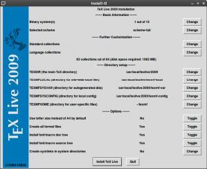
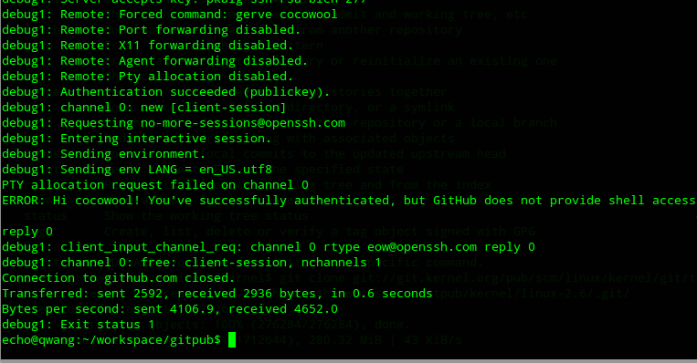
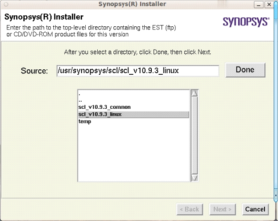
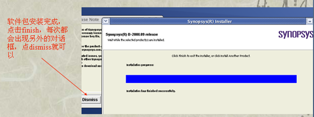
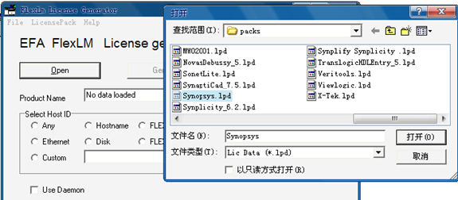
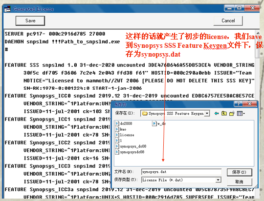
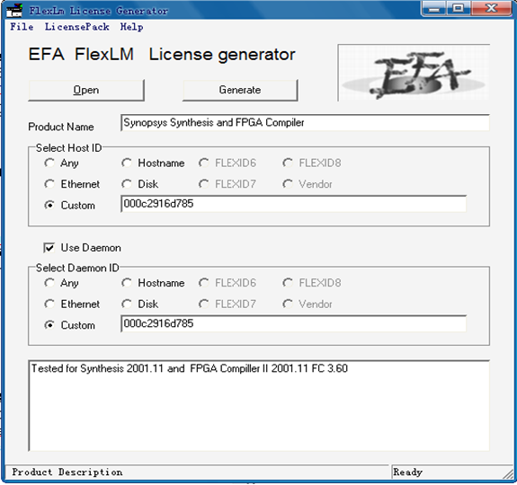

# 重要学术软件安装
## 安装及配置matlab
(1) 配置Matlab使用的Java环境:

```
sudo update-alternatives --config java
export MATLAB_JAVA=/usr/lib/jvm/java-6-sun-1.6.0.20/jre/
```

(2) 挂载iso文件:

```
sudo mount -o loop Mathworks.Matlab.R2012a.UNIX.iso /mnt
```

(3) 跳转到挂载目录:

```
cd /mnt
```

(4) 安装:

```
sudo ./install
```

(5) 安装中选择“不使用Internet安装”。

(6) 窗口界面默认安装位置为 /usr/local/MATLAB/R2012a。

(7) 接受许可协议。

(8) 输入安装密钥：

```
37176-43568-09521-61284-60764-48411-11831-17282-31342-18748-48552-26727-08411
```

(9) 安装类型选择“自定义”；

(10) 点击“安装”进行安装；

(11) 倒入许可协议（/mnt/crack/lic\_standalone.dat）；

(12) 等待安装结束;

(13) 设置快捷方式：

a.将附件里的matlab.desktop文件放在 /usr/share/applications 下，图片matlab.png放在/usr/share/icons。

b.建立软链接：

```
 sudo ln -s /usr/local/MATLAB/R2012a/bin/matlab /usr/bin/matlab
```

(14) 解决中文乱码问题：

1.字体显示美化: 进入Matlab，从菜单打开Files->preferences，打开Fonts页，把右边最下面的复选框Use antialising to smooth desktop fonts选中，重启MATLAB，字体显示的效果就很好了.

2.MATLAB使用自带的Java运行环境，根据CPU架构的不同，相对应的字体配置文件路径为：

32位版本 /usr/local/matlab/sys/java/jre/glnx86/jre/lib/fontconfig.properties

64位版本 /usr/local/matlab/sys/java/jre/glnxa64/jre/lib/fontconfig.properties

下面以32位版本为例进行说明。

3.进入字体配置文件目录：

```
cd /usr/local/MATLAB/R2012a/sys/java/jre/glnx86/jre/lib
```

如果fontconfig.properties文件不存在，可以从fontconfig.properties.src复制一个:

```
sudo cp fontconfig.properties.src fontconfig.properties
```

4.字体可直接用系统自带的文泉驿:

修改JRE的字体配置文件，打开配置文件：

```
sudo gedit fontconfig.propertie
```

加入中文字体定义，在version=1下面一行输入

```
allfonts.chinese-arphic1=-misc-simsun-medium-r-normal--0-0-0-0-p-0-iso10646-1
```

如果文件已有allfonts.chinese-arphic1这行，就直接把它们改成上面那样。

指明中文字体路径，在allfonts.chinese-arphic1行后回车另起一行，输入中文字体文件的完整路径：

```
filename.-misc-simsun-medium-r-normal--0-0-0-0-p-0-iso10646-1=/usr/share/fonts/truetype/wqy/wqy-microhei.ttc
```

5.修改字体搜索, 在配置文件中查找sequence.allfonts，如果其后的sequence开头的行中有: chinese-arphics1，可以略过此步，否则在其后面加入一行：

```
sequence.fallback=chinese-arphic1
```

(15) 解决/usr/bin/matlab: 1: /usr/local/MATLAB/R2012a/bin/util/oscheck.sh: /lib/libc.so.6: not found

对于３２位系统：

```
sudo ln -s /lib/i386-linux-gnu/libc.so.6 /lib/libc.so.6
```

对于６４位系统：

```
sudo ln -s /lib/x86_64-linux-gnu/libc.so.6 /lib64/libc.so.6
```

## Vmware安装及配置

## Virtualbox安装及配置
(1) 双击deb文件进行安装;

(2) 选择对应版本的extension包进行安装;

(3) I'm on Ubuntu 12.04 64-bit and encountered exactly this problem. What finally worked was going to the virtualbox website, downloading the package and installing it via:

```
sudo apt-get purge virtualbox dkms linux-headers-\$(uname -r)
sudo apt-get install linux-headers-\$(uname -r)
sudo dpkg -i virtualbox-4.2\_4.2.10-84104~Ubuntu~precise\_amd64.deb
```

Then I ran:

```
sudo /etc/init.d/vboxdrv setup
```

And it worked like a charm.

## Cuda模拟器Ocelot的安装及配置
(1) 建议使用svn checkout 最新的trunk:

```
sudo svn checkout http://gpuocelot.googlecode.com/svn/trunk/ gpuocelot
```

(2) 安装各种依赖包和库:

```
sudo apt-get install flex bison autoconf automake libtool  g++
sudo apt-get install libboost1.40-all-dev
sudo apt-get install  libglu1-mesa-dev freeglut3-dev mesa-common-dev
```

上面一行是安装图形库GL，这个在后面cuda sdk编译的时候会用到，反正安着也没坏处。我开始在安装ocelot的同时，手贱也去玩barra，安barra得注意几个包，因为需要直接和cuda sdk肉搏，常被告知 /usr/bin/ld 找不到 lxxx, 直接sudo apt-get install libxxx-dev就是了。

(3) 这些其实就可以进行正常编译了，当然，如果还想安装hydrazine也是可以的。

```
$ svn checkout http://hydrazine.googlecode.com/svn/trunk/ hydrazine
$ cd hydrazine
$ libtoolize; aclocal; autoconf; automake
$ ./configure;make;make check
$ sudo make install
```

(4) 编译ocelot:

```
$ cd gpuocelot/ocelot
$ libtoolize; aclocal; autoconf; automake
$ ./configure;make
```

建议进行安装，要不在后续进行regression test时也需要重新安装。

```
sudo make install
```

但是这里注意，还需要安装cuda toolkit。cuda sdk和cuda toolkit的版本最好是匹配的。

(5) 安装cuda 2.2 tookit：

```
gedit ~/.bashrc
```

添加：

```
PATH=/usr/local/cuda/bin：$PATH
LD_LIBRARY_PATH=/usr/local/cuda/lib:$LD_LIBRARY_PATH
```

(6) 进行regression test：

```
$ cd ../gpuocelot/tests/cuda2.2
$ libtoolize;aclocal; autoconf; automake
$ ./configure; make; make check
```

在make check 这一步常会出错，错误大致为：“/usr/include/c++/4.4/new:91: error: 'operator new' takes type 'size_t' ('unsigned int') as first parameter，”这个错误我在测试cuda2.3 和 cuda3.2的时候都出现过，很是无语，gcc.gnu.org说这是一个bug,我不知道如何应对，但是对于cuda2.2没有出现这个错误。

(7) 测试安装:

```
$  make test
```

## Cadence，Allegro和MMSIM的安装

## Mathematica的安装

## MPICh2的安装
(1) 下载MPICH2并使用下面命令解压:

```
tar xzf mpich2-1.3.2.tar.gz
cd mpich2-1.3.2
```

(2) 选择安装目录/home/<USERNAME>/mpich2-install, <USERNAME>改为您的用户名，并确保安装目录为空或不存在。

(3) 将 MPICH2配置到指定的安装目录:

```
$ sudo mkdir /usr/local/mpich2
$ ./configure --prefix=/usr/local/mpich2 2>&1 | tee c.txt
```

(4) 编译MPICH2:

```
$ make 2>&1 | tee m.txt
```

(5) 安装MPICH2命令:

```
$ make install 2>&1 | tee mi.txt
```

(6) 将安装目录中bin子目录添加到你的启动脚本中(.bashrc for bash):

```
PATH=/usr/local/mpich2/bin:$PATH ; export PATH
```

用以下命令进行命令的检查:

```
which mpicc
which mpiexec
```

这些命令应该显示出你安装目录的bin子路经.

(7) 使用下面命令测试安装是否成功<number>为要是用的cpu数目：

```
$ mpiexec -n <number> ./examples/cpi
```

## Modelsim的安装
(1) 直接运行

```
$ ./install.linux
```

如果权限不够，添加权限

```
$ sudo chmod a+x install.linux
```

由于是图形界面，很easy。

如果出现下面的错误：

```
Exception in thread "main" java.lang.UnsatisfiedLinkError:
/home/happy/mgc/install.ixl/JRE/lib/i386/xawt/libmawt.so: libXtst.so.6:
cannot open shared object file: No such file or directory
```

说明是在64位系统上运行了32位的Java，因此还需要安装以下软件包：

```
$ sudo apt-get install libxtst6:i386 libxi6 libxrender1
```

(2) 破解：

a.修改license.src和mentor文件，将前两行的SERVER和VENDER的信息按照Linux系统进行修改。

```
SERVER HostName MACADDR 27001
VENDOR mgcld /path-to-modelsim/modeltech/linux/mgcld
```

b.安装wine:

```
aptitude install wine
```

c.运行wine MentorKG.exe 生成LIENCE.TXT.

d.添加license到path里面:

```
vim ~/.bashrc
export LM_LICENSE_FILE=[license存放目录]/LICENSE.TXT
export PATH=$PATH:[modelsim安装目录]/bin
source ~/.bashrc
```

e.在ubuntu 12.04上需要修改modeltech/bin/vsim文件的204行，增加
```
\ 3.[1-9].[0-9]*)    vco="linux" ;;\
```

将crack/linux中的三个文件拷贝到Modelsim的安装目录Modelsim/modeltech/linux/mgls/lib目录中，然后运行$patch\_2013$中的命令：

```
./sfk6 rep -yes -pat -bin /5589E557565381ECD00000008B5508/31C0C357565381ECD00000008B5508/ -dir ./
```

如果在输出的信息中出现

```
[total hits/matching patterns/non-matching patterns]
error: failed to read+write: sfk6 - skipping
[001/1/0] mgcld
[001/1/0] mgls_asynch
5 files checked, 2 changed.
1 errors occurred.
```

说明破解是成功的。如果是0 files checked,  在ubuntu下加sudo试试。

(3) 运行:

```
$ vsim
```

如果不能创建文件，考虑权限问题.如果在64位系统中出现下面的错误:

```
error while loading shared libraries: libXft.so.2
```

则运行下面的命令:

```
$ sudo apt-get install ia32-libs
```

## Nero的安装

(1) 双击deb文件进行安装;

## NS2的安装
(1) 首先需要安装的是：

```
sudo apt-get install build-essential
sudo apt-get install tcl8.4 tcl8.4-dev tk8.4 tk8.4-dev
sduo apt-get install libxmu-dev libxmu-headers
```

(2) 把解压缩后的资料夹移动到你想安装的位置去:

```
$ tar xvfz ns-allinone-2.31.tar.gz
$ sudo mv ns-allinone-2.31 /usr/local/NS2
$ sudo chmod 777 -R NS2
$ cd /usr/local/NS2
$ ./install
```

经过一些时间的等待，就会看到他显示一串要你修改.bashrc或.cshrc的讯息，依照提示信息加入。如果是.bashrc的话就会是：

```
export PATH=$PATH:/usr/local/NS2/bin:/usr/local/NS2/tcl8.5.10/unix:/usr/local/NS2/tk8.5.10/unix
export LD_LIBRARY_PATH=$LD_LIBRARY_PATH:/usr/local/NS2/otcl-1.14:/usr/local/NS2/lib
export TCL_LIBRARY=$TCL_LIBRARY:/usr/local/NS2/tcl8.5.10/library
```

(3) 接着依照最后几行的讯息去做验证，例如：

```
$ cd ns-2.31; ./validate
```

当ns回车出现%说明正确。

## OMNet++的安装
(1) 安装必要的软件：

```
$ sudo apt-get install build-essential gcc g++ bison flex perl \
tcl-dev tk-dev blt libxml2-dev zlib1g-dev openjdk-6-jre \
doxygen graphviz openmpi-bin libopenmpi-dev libpcap-dev
```

(2) 添加环境变量：

在.bashrc中增加如下代码：

```
export PATH＝/home/happy/omnet++-4.4.1/bin:$PATH
export TCL_LIBRARY=/usr/share/tcltk/tcl8.5
```

(3) 配置、编译和安装：

```
$ ./configure
$ make
```

## SystemC-2.2的安装(SystemC-2.3可以直接安装)

1. Either install a Linux system natively or install a Virtual machine (VirtualBox) (recommended).

2. Download systemc-2.2.0.tgz.

3. tar -xvf systemc-2.2.0.tgz.

4. cd systemc-2.2.0.

5. configure --prefix=/usr/local/systemc-2.2.

6. sudo mkdir /usr/local/systemc-2.2.

7.0. add '\#include <cstdlib>' and '\#include <string.h>' before '\#include "sysc/utils/sc\_report.h"' in systemc-2.2.0/src/sysc/utils/sc\_utils\_ids.cpp.

7.1 error: reference 'm\_obj' cannot be declared 'mutable' [-fpermissive].

这个错误信息有好几行连续的，找到sc\_bit\_proxies.h，将那几行中的mutable都删去即可。

8. make (ignore the complilation error of example code).

9. sudo make install.

10. add newline with expression:

```
SYSTEMC_HOME=”/usr/local/systemc-2.2/“ in /etc/environment
export SYSTEMC_HOME=/usr/local/systemc-2.2/
```

11. To compile a systemC program simply use this expression:

```
g++ -I. -I$SYSTEMC\_HOME/include -L. -L$SYSTEMC\_HOME/lib-linux -o sim hello.cpp -lsystemc -lm %32 bit OS
g++ -I. -I$SYSTEMC\_HOME/include -L. -L$SYSTEMC\_HOME/lib-linux64 -o sim hello.cpp -lsystemc -lm %64 bit OS
```

the example code:

```
// All systemc modules should include systemc.h header file
#include "systemc.h"
// Hello_world is module name
SC_MODULE (hello_world) {
  SC_CTOR (hello_world) {
    // Nothing in constructor
  }
  void say_hello() {
    //Print "Hello World" to the console.
    cout << "Hello World.\n";
  }
};
// sc_main in top level function like in C++ main
int sc_main(int argc, char* argv[]) {
  hello_world hello("HELLO");
  // Print the hello world
  hello.say_hello();
  return(0);
}
```

## SoCLib的安装

## TeX Live 2011 安装步骤
CTEX 有 TexLive （TexLive为Latex安装包的名字）的所有内容，还包括了中文的支持。但是在Linux环境下没有对应的ctex安装包.

（1）准备如下材料：TeX Live 2011光盘镜像，Windows字体（从Windows 系统拷贝），Adobe字体（网络下载）。

（2）首先安装 perl-tk：

```
$ sudo aptitude install perl-tk
```

（3）挂载 TeX Live 2011 镜像：

```
sudo mkdir /mnt/iso
sudo mount -o loop texlive2011.iso /mnt/iso
```

（4）安装：

```
$ sudo /mnt/iso/install-tl --gui
```

（5）安装TeX Live 2011：

信息读取完毕后，探出一个界面如下：



<center>Texlive安装界面</center>

我把最后一项“自动创建链接”修改外，其他保持原样。点击“安装TeX Live“。

（6）配置环境变量:

```
vi ~/.profile或者vim /etc/bash.bashrc
```

然后把以下代码添加进去(注意path一定要将texlive放在前面):

```
PATH=/usr/local/texlive/2011/bin/i386‐linux:$PATH; export PATH
MANPATH=/usr/local/texlive/2011/texmf/doc/man:$MANPATH; export MANPATH
INFOPATH=/usr/local/texlive/2011/texmf/doc/info:$INFOPATH; export INFOPATH
```

接着，修改/etc/manpath.config:    

```
$ sudo  vi /etc/manpath.config
```

在\# set up PATH to MANPATH mapping下输入:

```
MANPATH_MAP /usr/local/texlive/2011/bin/i386-linux /usr/local/texlive/2011/texmf/doc/man
```

（7）配置中文环境和中文字体安装:

a.创建Windows字体目录ＷinFonts和Adobe字体目录AdobeFonts:

```
sudo mkdir /usr/share/fonts/WinFonts
sudo mkdir /usr/share/fonts/AdobeFonts
```

b.复制上述准备的字体到各自目录.这里需要注意：修改上面拷贝字体的权限:

```
sudo chmod 644 /usr/share/fonts/WinFonts/*
sudo chmod 644 /usr/share/fonts/AdobeFonts/*
```

如果没有这一步，会在编译tex文件时出现下面类似的错误：

```
SimSun at 17.28pt not loadable
```

c.刷新字体缓存:

```
sudo  mkfontscale
sudo mkfontdir
sudo fc-cache -fsv
```

（8）安装中文字体后的配置：

a.查看系统中安装的中文字体的名字。

```
$ fc-list :lang=zh | sort
```

b.查看并根据生成的 fonts 编辑 ctex-xecjk-winfonts.def:

```
$ sudo  vi/usr/local/texlive/2011/texmf-dist/tex/latex/ctex/fontset/ctex-xecjk-winfonts.def
```

编辑前ctex-xecjk-winfonts.def如下：

```
% ctex-xecjk-winfonts.def: Windows 的 xeCJK 字体设置,默认为六种中文字体
　　%vim:ft=tex
　　\setCJKmainfont[BoldFont={SimHei},ItalicFont={[simkai.ttf]}]  
　　　　{SimSun}
　　　　\setCJKsansfont{SimHei}
　　　　\setCJKmonofont{[simfang.ttf]}
　　　　\setCJKfamilyfont{zhsong}{SimSun}
　　　　\setCJKfamilyfont{zhhei}{SimHei}
　　　　\setCJKfamilyfont{zhkai}{[simkai.ttf]}
　　　　\setCJKfamilyfont{zhfs}{[simfang.ttf]}
　　　　\newcommand*{\songti}{\CJKfamily{zhsong}} % 宋体
　　　　\newcommand*{\heiti}{\CJKfamily{zhhei}}   % 黑体
　　　　\newcommand*{\kaishu}{\CJKfamily{zhkai}}  % 楷书
　　　　\newcommand*{\fangsong}{\CJKfamily{zhfs}} % 仿宋
　　　　\newcommand*{\lishu}{\CJKfamily{zhli}}    % 隶书
　　　　\newcommand*{\youyuan}{\CJKfamily{zhyou}} % 幼圆
　　　　\endinput
```

其中带中括号的字体名都是需要修改的，

这时需运行:

```
$ fc-list :lang=zh-cn
```

来查看系统中的中文字体，记下楷体和仿宋对应的名称，即显示信息中第一个英文在我的系统中楷体是 KaiTi，仿宋是 FangSong不过会因为安装的字体版本不同而有所差异.

接下来只要将对应的字体修改即可，即把[SIMKAI.TTF]修改为KaiTi,把[SIMFANG.TTF]修改为FangSong,编辑后 ctex-xecjk-winfonts.def 的内容：

```
% ctex-xecjk-winfonts.def: Windows 的 xeCJK 字体,默认六种中易字体
　	% vim:ft=tex
　　　　\setCJKmainfont[BoldFont={SimHei},ItalicFont={KaiTi}]  {SimSun}
　　　　\setCJKsansfont{SimHei}
　　　　\setCJKmonofont{FangSong}
　　　　\setCJKfamilyfont{zhsong}{SimSun}
　　　　\setCJKfamilyfont{zhhei}{SimHei}
　　　　\setCJKfamilyfont{zhkai}{KaiTi}
　　　　\setCJKfamilyfont{zhfs}{FangSong}
　　　　\setCJKfamilyfont{zhli}{LiSu}
　　　　\setCJKfamilyfont{zhyou}{YouYuan}
　　　　\newcommand*{\songti}{\CJKfamily{zhsong}} % 宋体
　　　　\newcommand*{\heiti}{\CJKfamily{zhhei}}   % 黑体
　　　　\newcommand*{\kaishu}{\CJKfamily{zhkai}}  % 楷书
　　　　\newcommand*{\fangsong}{\CJKfamily{zhfs}} % 仿宋
　　　　\newcommand*{\lishu}{\CJKfamily{zhli}}    % 隶书
　　　　\newcommand*{\youyuan}{\CJKfamily{zhyou}} % 幼圆
　　　　\endinput
```

c.ctex-xecjk-adobefonts.def不用改。

d.安装ctex:

```
sudo tlmgr install xeCJK ctex
```

（9）输入一个典型的中文支持例子测试，用xelatex或pdflatex命令编译：

```
\documentclass[UTF8]{ctexart}　　　　
\begin{document}　　　　
这是我的第一个\TeX{}文件　　　　
\end{document}
```

（10）安装texmaker：

```
sudo apt-get install texmaker
```

## 安装Cuda

## 安装Android开发环境

## 安装Blender软件

## 安装Bochs软件

## 安装Docear

## 安装glimpse

## 安装gephi

## 安装IDA Pro

## 安装Jabref

## 安装Ruby
```
$ sudo apt-get install ruby irb rdoc
```

## 安装lxr

## 安装Maple

## 安装Tomcat
(1) 下载地址:
```
http://java.sun.com/javase/downloads/index.jsp
```

选择jdk-6u3-linux-i586.bin下载(可以下载最新的，但要注意一定不能是....i586-rpm.bin,一般Ubuntu下没有rpm工具)，将jdk-6u3-linux-i586.bin放置于任意目录下，例如/home/test。

(2)更改文件权限为可执行、解压：

```
cd /home/test
chmod u+x jdk-6u3-linux-i586.bin
sudo ./jdk-6u3-linux-i586.bin yes/no选择yes，执行完之后边可
```

以在test目录下面看到文件夹jdk1.6.0\_03。

(3) 设置环境变量：

```
sudo vi /etc/profile   在profile文件最后添加
JAVA_HOME=/home/test/jdk1.6.0_03
export JRE_HOME=$JAVA_HOME/jre
export CLASSPATH=$JAVA_HOME/lib:$JRE_HOME/lib:$CLASSPATH
export PATH=$JAVA_HOME/bin:$JRE_HOME/bin:$PATH
```

保存并关闭。

(4) 重启系统 (也可以不用重启系统先logout然后login)。

(5) 在终端输入java -version，如果显示java版本的相关信息，则表示jdk安装成功。

(6) 下载tomcat 6：

```
http://apache.etoak.com/tomcat/tomcat-6/v6.0.20/bin/apache-tomcat-6.0.20.tar.gz
```

(7) 解压：

```
tar zxvf apache-tomcat-6.0.20.tar.gz
````

会在同一目录下产生apache-tomcat-6.0.20文件夹；可以把apache-tomcat-6.0.20 拷贝到任意目录；

```
sudo cp -r apache-tomcat-6.0.20 /var/tomcat6
cd /var/tomcat6/bin
sudo ./startup.sh 或sudo ./catalina.sh run
```

在浏览器输入 http://主机地址:8080/就能看到tomcat界面了.

(8) tomcat设置:

```
cd /var/tomcat6/conf
sudo vi/tomcat-users.xml
<user username="tomcat" password="tomcat" roles="admin,manager"/>
```

增加进入文件内文中 保存退出；

(9) 重新启动tomcat:

回到bin目录找到shutdown.sh，运行下列运行命令重新tomcat:

```
 sudo ./shutdown.sh
 sudo ./startup.sh
```

等待提示后就说明启动好了。

(10) 在“tomcat界面”---“manager”输入上面的用户名和密码后就能管理站点了.

## 安装GTK

```
apt-get install build-essential #这将安装gcc/g++/gdb/make 等基本编程工具
apt-get install gnome-core-devel #这将安装 libgtk2.0-dev libglib2.0-dev 等开发相关的库文件
apt-get install pkg-config #用于在编译GTK程序时自动找出头文件及库文件位置
apt-get install devhelp #这将安装 devhelp GTK文档查看程序
apt-get install libglib2.0-doc libgtk2.0-doc #这将安装 gtk/glib 的API参考手册及其它帮助文档
apt-get install glade libglade2-dev #这将安装基于GTK的界面GTK是开发Gnome窗口的c/c++语言图形库。
apt-get install libgtk2.0*, gtk+2.0所需的所有文件统通下载安装完毕。
```

应用程序编译命令：gcc test.c `pkg-config --cflags --libs gtk+-2.0`，编译通过，运行正常。

pkg-config是一个用来管理包的程序，在控制台输入 pkg-config --cflags --libs gtk+-2.0，可以发现输出的文本包括了gcc编译gtk+2.0所需要的所有选项（头文件目录和库文件）。

这里有一点需要注意， gcc test.c `pkg-config --cflags --libs gtk+-2.0`, pkg-config --cflags --libs gtk+-2.0两侧的引号并不是真正的引号，而是键盘数字件那一行，最左边的那个字符。如果错用了单引号，gcc无法使用 pkg-config --cflags --libs gtk+-2.0产生的文本作为编译选项。

## 安装PHP
安装平台基于Ubuntu 9.04.使用apt-get简单安装.在安装之前你要准备好源.还有安装库g++ vim ssh links因为你要用到这些功具.

(1) Install Tools:

```
$ sudo apt-get install g++ vim links ssh
```

(2) 安装MySQL 5.0:

```
$ sudo apt-get install mysql-server mysql-client
```

在安装这个过程中会提示让你输入MYSQL数据库的密码:

New password for the MySQL “root” user: <– yourrootsqlpassword 你的MYSQL密码

Repeat password for the MySQL “root” user: <– yourrootsqlpassword 你的MYSQL密码

(3) 安装Nginx:

```
$ sudo apt-get install nginx
```

启动nginx:

```
$ sudo /etc/init.d/nginx start
```

在IE浏览器输入你的IP地址: http://myip

```
$ sudo links ls.ptubuntu.com
```

看到welcome to nginx说明你已安装上了nginx了.接下来我们要来配置它.设置启动系统时会自动启动它.

```
$ sudo update-rc.d nginx defaults
```

提示:System startup links for /etc/init.d/nginx already exist.

(4) 安装 PHP5:

```
$ sudo apt-get install php5-cgi php5-mysql php5-curl php5-gd php5-idn php-pear php5-imagick php5-imap php5-mcrypt php5-memcache php5-mhash php5-ming php5-pspell php5-recode php5-snmp php5-sqlite php5-tidy php5-xmlrpc php5-xsl
```

接下来要配置php.ini这个文件,在做一些配置文件之前最好你要做一个备份.

```
root@ptUbuntu:~# cd /etc/php5/cgi/
root@ptUbuntu:/etc/php5/cgi# ls
conf.d  php.ini
root@ptUbuntu:/etc/php5/cgi# cp php.ini php.ini.bak
root@ptUbuntu:/etc/php5/cgi# vi php.ini
在php.ini这个文件里添加下一行
cgi.fix_pathinfo = 1
```

(5) 安装lighttpd:

```
$ sudo apt-get install lighttpd
```

安装完接下来要移除它的自动启动程序让它不自动启动.

```
$sudo update-rc.d -f lighttpd remove
Removing any system startup links for /etc/init.d/lighttpd …
/etc/rc0.d/K09lighttpd
/etc/rc1.d/K09lighttpd
/etc/rc2.d/S91lighttpd
/etc/rc3.d/S91lighttpd
/etc/rc4.d/S91lighttpd
/etc/rc5.d/S91lighttpd
/etc/rc6.d/K09lighttpd
```

开启PHP FastCGI 设置听的端口9000上运行的本地用户和www-data, 运行下面程序:

```
$ sudo /usr/bin/spawn-fcgi -a 127.0.0.1 -p 9000 -u www-data -g www-data -f /usr/bin/php5-cgi -P /var/run/fastcgi-php.pid
```

显示 spawn-fcgi.c.197: child spawned successfully: PID: 29470

修改rc.local 这个文件.先备份一个.

```
sudo cp /etc/rc.local .
sudo vi /etc/rc.local
添加
/usr/bin/spawn-fcgi -a 127.0.0.1 -p 9000 -u www-data -g www-data -f /usr/bin/php5-cgi -P /var/run/fastcgi-php.pid
```


配置sites-available/default:

```
sudo cp default default.bak
sudo vi default
```
```
# You may add here your

# server {

#    …

# }

# statements for each of your virtual hosts

server {
listen   80;
server_name  ls.ptUbuntu.com localhost;
access_log  /var/log/nginx/localhost.access.log;
location / {
root   /var/www/nginx-default;
index  index.php index.html index.htm;
}
location /doc {
root   /usr/share;
autoindex on;
allow 127.0.0.1;
deny all;
}
location /images {
root   /usr/share;
autoindex on;
}
#error_page  404  /404.html;

# redirect server error pages to the static page /50x.html

#
error_page   500 502 503 504  /50x.html;
location = /50x.html {
root   /var/www/nginx-default;
}

# proxy the PHP scripts to Apache listening on 127.0.0.1:80

#
#location ~ \.php$ {
#proxy_pass   http://127.0.0.1;
#}

# pass the PHP scripts to FastCGI server listening on 127.0.0.1:9000

location ~ \.php$ {
fastcgi_pass   127.0.0.1:9000;
fastcgi_index  index.php;
fastcgi_param  SCRIPT_FILENAME  /var/www/nginx-default$fastcgi_script_name;
include        fastcgi_params;
}
#
#location ~ \.php$ {
#fastcgi_pass   127.0.0.1:9000;
#fastcgi_index  index.php;
#fastcgi_param  SCRIPT_FILENAME  /scripts$fastcgi_script_name;
#includefastcgi_params;
#}

# deny access to .htaccess files, if Apache’s document root

# concurs with nginx’s one

#
#location ~ /\.ht {
#deny  all;
#}
}

# another virtual host using mix of IP-, name-, and port-based configuration

#
#server {
#listen   8000;
#listen   somename:8080;
#server_name  somename  alias  another.alias;
#location / {
#root   html;
#index  index.html index.htm;
#}
#}

# HTTPS server

#
#server {
#listen   443;
#server_name  localhost;
#ssl  on;
#ssl_certificate  cert.pem;
#ssl_certificate_key  cert.key;
#ssl_session_timeout  5m;
#ssl_protocols  SSLv2 SSLv3 TLSv1;
#ssl_ciphers  ALL:!ADH:!EXPORT56:RC4+RSA:+HIGH:+MEDIUM:+LOW:+SSLv2:+EXP;
#ssl_prefer_server_ciphers   on;
#location / {
#root   html;
#index  index.html index.htm;
#}
#}
```

创建一个info.php页面.
```
#vi /var/www/nginx-default/info.php
```
```
 <?php phpinfo(); ?>
```
重启nginx:
```
sudo /etc/init.d/nginx restart
sudo /etc/init.d/lighttpd stop
```

这lighttp 要关了.要不然会网页显示会给跑到这里来.因为nginx \& ligttpd两个同时打开也会发生冲突的.而这里我们只是用到lighttp的插件所以没有必要开启.

(6) 接下来要安装的是支持PHP mysql:

```
wget http://nchc.dl.sourceforge.net/sourceforge/phpmyadmin/phpMyAdmin-2.11.9.5-all-languages.tar.bz2
root@ptUbuntu:/usr/local/src#cp phpMyAdmin-2.11.9.5-all-languages.tar.bz2 /var/www/nginx-default/
root@ptUbuntu:/usr/local/src#cd /var/www/nginx-default/
root@ptUbuntu:/usr/local/src#tar xvf phpMyAdmin-2.11.9.5-all-languages.tar.bz2
root@ptUbuntu:/usr/local/src#mv phpMyAdmin-2.11.9.5-all-languages phpmyadmin
root@ptUbuntu:/usr/local/src#cd phpmyadmin/
```

接着修改配置文档.
```
root@ptUbuntu:/usr/local/src#cp config.sample.inc.php config.inc.php
*/
   $cfg['blowfish_secret'] = ‘ptUbuntu’;     ptubuntu  改为你的mysql密码
/*
```

其他地方也就不用改了就可以使用了.

还有下面的软件包：

php5-cgi php5-mysql php5-curl php5-gd php5-idn php-pear php5-imagick php5-imap php5-mcrypt php5-memcache php5-mhash php5-ming php5-pspell php5-recode php5-snmp php5-sqlite php5-tidy php5-xmlrpc php5-xsl
　　
## 安装QT
Linux下安装Qt4有两大问题，一是环境变量，二是IDE（集成开发环境）。安装Qt4也有两种方法，一种是apt-get，一种是下载源码包，而后一种方法已经人证实是最有可能不好使的方法。所以我最终采用了apt-get的方式。而apt-get也有两种方式（这就是Free OS之不爽之处）：新立得与命令行。这里强烈建议大家使用命令行方式！因为新立得里面的东西太乱，你很可能下载了一大堆东西却没一个是我们真正需要的，而 且下载完成后要自己去配置环境变量。

提到环境变量，我不得不多说两句。这真的是一个可恶的东西！到现在我也没弄明白到底是在/etc/profile中改还是在/.profile中改。

关于IDE，网上有人通过设置KDevelop跑起来Qt，但也不是非常的好使，关键时刻还是有找不到的头 文件。QDevelop是Qt的官方IDE，据说跟Qt4配合得更好一些，所以我选用这个。

利用apt-get安装Qt4过程如下：

Ubuntu Linux下配置Qt4的步骤（我的Ubuntu是8.04版）：

1、请在你的电脑里或虚拟机里安装好Ubuntu 8.04版。

2、改源并更新，详细操作请参考wiki.ubuntu.org.cn上面的“快速配置指南”。

3、请不要按捺不住热切的心情安装任何软件更新。

4、启动终端，命令：sudo apt-get install build-essential

5、等待。

6、sudo apt-get install qt4-dev-tools qt4-doc qt4-qtconfig qt4-demos qt4-designer

注意在这个版本的软件包中，qt4-dev-tools 包含了Qt Assistant及Qt Linguist等工具，因此不需要单独安装这两个工具。其它的，qt4-doc 是帮助文档，包含了Qt中各个类库的详细说明以及丰富的例子程序，可以使用Qt Assistant 工具来打开阅读。qt4-qtconfig 是配置Qt环境的一个对话框，一般默认就行了，很少有必要去更改。qt4-demos 包含很多可以运行起来的可执行文件以及源代码。qt4-designer是用来设计GUI界面的设计器。

7、继续等待并祈祷。

8、你要用QDevelop的话就sudo apt-get install qdevelop吧。

9、如果你用QDevelop的话，就直接启动它，你可能会发现提示“Qt文件夹不存在”之类的提示，这是因为有些工具还没有被安装，如qmake，ctags之类，不要被小红叉吓倒，执行以下语句就可以：sudo apt-get install libqt4-dev。

10、有可能到这儿还有一个ctags的红叉，可以执行：apt-get install ctags，他会自动帮你查出来并装上，真是方便。然后环境变量不再提示出错，你可以进入Qdevelop，尽情地coding吧！

附：网上查资料过程中看到的也许以后有用：

1、为了连接MySQL数据库，需要安装连接MySQL的驱动程序：sudo apt-get install libqt4-sql-mysql

比起在Windows下安装和配置Qt的MySQL驱动来说，简直太方便了。如果还需要其它的没有默认安装的Qt库，可以在命令行输入 sudo apt-get install libqt4- 然后按tab键自动补全，就会列出所有以libqt4- 开头的软件包。这些都可以使用一个命令搞定，而不需要自己从源码开始编译。在记不准或不知道名字的情况下，使用tab键列出所有可选的软件包是一个很实用的小技巧。

2、在我的项目中，还需要画一些数据曲线和统计图表等，而第三方的QWT库提供了这些功能。同样，只需要一个命令即可完成安装：sudo apt-get install libqwt5-qt4 libqwt5-qt4-dev，这时，打开Qt Designer，就会发现左边的Widget列表里面多了“Qwt Widget”这一组。

3、关于集成开发环境我觉得QDevelop很不错，它跟Qt Designer结合的很好，而且有提示类成员函数的功能。使用Qdevelop编写代码和编译、调试，使用Qt Designer设计界面，开发效率较高。

## Java安装
(1)开发JAVA程序的JDK环境(如果仅是运行Java程序，可用sun-java6-jre):

```
sudo apt-get install sun-java6-jdk --force-yes -y
```

(2)安装浏览器的JAVA Plugin:

```
sudo apt-get install sun-java6-plugin --force-yes -y
```

## 安装MySQL

```
sudo apt-get install mysql-server mysql-client --force-yes -y
```

(1)root原密码为空，给它加个密码:

```
mysqladmin -uroot password 123456
```

(2)重启动mysql服务（此步可省）:

```
mysqladmin -uroot -p123456 shutdown
sudo mysqld\&
```

## 安装绘图工具
//和Visio类似的dia（默认只能在命令行启动）

```
sudo apt-get install dia --force-yes -y
```
//画UML图的umbrello
```
sudo apt-get install umbrello --force-yes –y
```

## 安装eclipse

```
$ sudo apt-get install eclipse
```

## 安装vim

```
$ sudo apt-get install vim
```

vim中比较常用的配置：

```
set number
set ic
set colorcolumn=81
set hlsearch
set cursorline
syntax on
highlight WhitespaceEOL ctermbg=red guibg=red
match WhitespaceEOL /\s\+$/
set expandtab
set tabstop=4
set scrolloff=4
set softtabstop=4
set ignorecase
set showmatch
set wrapscan
```

其中，第一行显示行号，第二行增量搜索，第三行会在第81列显示一个红色竖线，第四行会高亮搜索项，第五行会高亮显示当前行，第六开打开语法高亮，第七行和第八行用于高亮显示行尾空格, 第8-10行将tab替换为4个空格，第11行忽略大小写，第12行高亮显示搜索项，第14行开启环形搜索。

## 安装Emacs

(1) 安装emacs;

(2) 修改emacs配置文件，将下面的内容拷贝到/home目录下的.emacs.conf文件中。

## 视频编辑

```
sudo apt-get install openshot
sudo apt-get install cheese
```

## 游戏工具箱

```
$ sudo apt-get install playdeb
```

## 安装Python

```
$ sudo apt-get install python python-dev python-pip
```

## 安装版本管理工具
(1)安装各种版本管理工具:

```
$ sudo apt-get install subversion cvs git git-core git-doc git-svn git-email git-gui gitk
```

(2)配置git版本管理工具:

```
$ git config --global user.name happybaoliang
$ git config --global user.email happybaoliang@gmail.com
$ git config --global core.editor vim
```

(3)创建验证用的公钥:

git默认是通过ssh的方式来访问资源库的，所以需要在本地创建验证用的文件。

```
$ ssh-keygen -C 'happybaoliang@gmail.com' -t rsa
```

上述命令会在\~/.ssh/目录下建立相应的密钥文件，然后可以使用下面的命令来测试链接是否畅通：

```
$ ssh -v git@github.com
```

(4)上传公钥: 在github.com的界面选择右上角的account settings然后选择SSH Public Keys，再选择添加。Title可以随便命名，key的内容拷贝自\~/.ssh/id\_rsa.pub的内容（可以通过cat命令查看）。然后运行下面的命令即可查看是否链接建立成功。

```
$ ssh -v git@github.com
```

如果输出图\ref{github}所示的信息则说明链接建立成功。



<center>github连接建立成功</center>

(5)配置显示颜色:

```
$ git config --global color.status auto
$ git config --global color.diff auto
$ git config --global color.branch auto
$ git config --global color.interactive auto
```

(6)中文乱码的解决方法: 在bash提示符下输入：

```
$ git config --global core.quotepath false
```

core.quotepath设为false的话，就不会对0×80以上的字符进行quote。中文显示正常。

然后输入下面命令：

```
$ git config --global gui.encoding utf-8
$ git config --global i18n.commitencoding utf-8
$ git config --global i18n.logoutputencoding gbk
```

## 安装perl

```
$ sudo apt-get install perl
```

## 安装GEM5
(1) 将下载的gem5-stable-aaf017eaad7d.tar安装包解压，文件夹重命名为gem5\_stable。

(2) 因为SCons是用Python编写的，所以你必须在使用SCons之前安装好Python (2.7.5)。

(3) 安装scons （2.1以上）;

```
$ sudo apt-get install scons
```

(4) 安装swig （2.07以上）;

```
$ sudo apt-get install swig
```

(5) 安装zlib (1.2.8以上);

```
$ sudo apt-get install zlib
```

(6) 安装M4: 先将下载的m4-1.4.17.tar.gz解压:tar -xzvf m4-1.4.17.tar.gz解压之后的文件夹 m4-1.4.17放到gem5\_stable目录下cd m4-1.4.17,然后执行命令：

```
$ sudo ./configuresudo make install
```

(7) 安装protobuf:

将下载的安装包解压后进入源代码目录

```
./configure
sudo make install
```

(8) 安装libprotobuf-dev:

```
$ sudo apt-get install libprotobuf-dev
```

(9) 安装libgoogle-perftools-dev:

```
$ sudo apt-get install libgoogle-perftools-dev
```

(10) 编译gem5：

```
cd gem5-stable
sudo mkdir build
```

指定编译的选项及目标文件，例如：

scons build/ALPHA/gem5.opt

如果出现如下错误：

错误：can't find Python.h header in ['/usr/include/python2.7']解决：sudo apt-get install python-dev

(11) 测试SE模式下的Hello World, 在gem5目录下输入命令

```
./build/ALPHA/gem5.opt ./configs/example/se.py -c tests/test-progs/hello/bin/alpha/linux/hello 
gem5 Simulator System.  http://gem5.org
gem5 is copyrighted software; use the --copyright option for details.

gem5 compiled Nov 22 2013 21:02:57
gem5 started Nov 22 2013 21:06:19
gem5 executing on ubuntu
command line: ./build/ALPHA/gem5.opt ./configs/example/se.py -c tests/test-progs/hello/bin/alpha/linux/hello
/home/hu/gem5-stable/configs/common/CacheConfig.py:48: SyntaxWarning: import * only allowed at module level
  def config_cache(options, system):
Global frequency set at 1000000000000 ticks per second
warn: CoherentBus system.membus has no snooping ports attached!
0: system.remote_gdb.listener: listening for remote gdb #0 on port 7000
**** REAL SIMULATION ****
info: Entering event queue @ 0.  Starting simulation...
info: Increasing stack size by one page.
Hello world!
hack: be nice to actually delete the event here
Exiting @ tick 3233000 because target called exit()
```

安装成功！

(12) 在full system下模式下运行alpha编译的测试程序:

在gem5-stable根目录下创建dist目录，并在该目录中创建alpha目录，并将下载的m5-system-2.03.tar.bz2解压，将其中的binaries和disks目录放在dist/alpha目录中。

修改GEM5/config/common/SysPath.py 文件：

把exceptKeyError: path = [ '/dist/m5/system', '/n/poolfs/z/dist/m5/system 修改成

```
except KeyError: path = [ '/dist/m5/system', ' /home/happy/gem5-stable/dist/alpha' ]
```

然后编译gem5:

```
~/gem5-stable \$ scons ./build/ALPHA/gem5.opt
```

可以通过 GEM5/m5out/system.terminal查看启动linux内核的monitor进程。

运行模拟的linux系统:

```
./build/ALPHA/gem5.opt ./configs/example/fs.py  
```

将看到如下界面:

```
gem5 Simulator System. http://gem5.org
gem5 is copyrighted software; use the --copyright option for details.
gem5 compiled Jul 13 2013 15:50:46
gem5 started Jul 13 2013 15:53:18
gem5 executing on jsi-desktop
command line: ./build/ALPHA/gem5.opt ./configs/example/fs.py
Global frequency set at 1000000000000 ticks per second
info: kernel located at: /home/wyj2/gem5-stable/dist/binaries/vmlinux
Listening for system connection on port 3456
      0: system.tsunami.io.rtc:Real-time clock set to Thu Jan  100:00:00 2009
warn: CoherentBus system.membus has no snooping ports attached!
0: system.remote_gdb.listener: listening for remote gdb #0 on port 7000
 REAL SIMULATION 
info: Entering event queue @ 0. Starting simulation...
warn: Prefetch instructions in Alpha do not do anything
warn: Prefetch instructions in Alpha do not do anything
```

开启另外一个ssh界面，使用M5Term来与simulatedsystem进行交互:

```
~/gem5-stable$cd ./util/term  
~/gem5-stable$make  
~/gem5-stable$sudo make install  
~/gem5-stable$m5term localhost 3456 
```

这样就进入了模拟出来的系统：

ls后就看到如下：

```
benchmarks  etc        linuxrc     modules     sys        var
bin         iscsi       lost+found  proc       tmp
dev         lib         mnt         sbin        usr
```

5、在模拟系统中运行一个测试程序试试：

```
　　#cd benchmarks
　　#ls
```

　　将看到如下几个测试程序：
```
　　aio-bench           netperf-bin         surge
　　micros              pthread_mutex_test
```
```
　　#./pthread_mutex_test2 2
```
　　运行结果如下：
```
　　Using 2 threadsfor 2 iters
　　Counter value is 4
```

现在以将GEM/tests/test-progs/hello/bin/alpha/linux/hello，mount进模拟的系统为例，讲述如何将编译好的程序mount进被模拟的系统。

1、将hello文件拷贝到当前路径的gem5-stable：

```
cp./tests/test-progs/hello/bin/alpha/linux/hello
./hello  
```

2、

```
sudo mount -o,loop,offset=32256 ./dist/disks/linux-latest.img /mnt
```

关于偏移量32256请参考链接：http://my.oschina.net/toyandong/blog/65002.

3、显示一下/mnt，可以看到挂载好的操作系统:

```
~/gem5-stable$ ls/mnt  
benchmarks  dev iscsi  linuxrc     mnt     proc  sys  usr  
bin         etc lib    lost+found  modules sbin  tmp  var 
```

4、  在使用linux的image文件之前，应该执行umount操作。  

```
~/gem5-stable\$ sudo umount /mnt
```

5、重新开启模拟的linux，进入模拟的linux (参考本文 “运行” 中的2和3) :

```
#ls  
可以看到我们添加的testGem5目录
benchmarks  etc        linuxrc     modules     sys        usr
bin         iscsi       lost+found  proc       testGem5   var
dev         lib         mnt         sbin        tmp
```

6、cd testGem5:

```
$ sudo ./hello
```

执行结果：

```
Hello world!
```

(13)在full system模式下运行x86程序的方法可以参考下面的网页:

```
http://blog.csdn.net/wyj7260/article/details/9320113
```

## 安装Design Compiler
1.在linux的根目录下建立/usr/synopsys文件夹。

2.在目录下创立以下的目录结构:

```
/usr/synopsys
|---installer
|---10.9.3
|---license
|---B-2008.09
```

3.安装installer。将install\_v2.0.rar.Z解压到/usr/synopsys/installer目录即可。

4.解压scl.rar到/usr/synopsys目录中。

5.在终端中以管理员账户下运行下面的命令：

```
#cd /usr/synopsys/installer/
#./installer -gui
```

便可以调出安装界面，如果运行出错说找不到setup.sh文件，则运行下面的命令安装csh。



<center>synopsys安装界面</center>
```
$ sudo apt-get install csh
```

6.选中scl\_v10.9.3\_linux文件后点击下一步，如下图所示：


<center>Synopsys安装界面</center>

然后一直next，过程中有些选项都不需要管，直到选中安装目标路径/usr/synopsys/10.9.3。软件包每次安装完以后，点击finish以后都会出现一个对话框，不管他直接点击dismiss就可以了。
　　
7.以同样的方法把scl\_v10.9.3\_common.tar文件安装到10.9.3目录。在安装过程中可能会出现下面的错误：

```
cannot find any platform files for product in /usr/synopsys/scl/scl\_v10.9.3\_common platform files.
```

不用理它，选择No，然后在弹出的对话框中选择next。然后即可完成安装。

8.将Design\_compiler\_2008.09\_linux.rar和Design\_Compiler\_2008.09\_common.rar解压到/usr/synopsys目录下。

9. 以同样的方法将common包和linux包安装好，这两个包的时候最好分开安装，先安装linux包。这两个包都放在/usr/synopsys/B-2008.09下。

10.以同样的方法将vcs-mx\_vD-2009[1].12\_linux.rar和vcs-mx\_vD-2009[1].12\_common.rar解压缩并安装好，这两个包的时候最好分开安装，先安装linux包。这两个包都放在/usr/synopsys/D-2009.12下。

11.在Windows环境下制作DC2008—license和启动配置文件:
　
（1）解压dc\_license.rar

（2）进入EFA LicGen 0.4b文件夹，双击里面的licGen.exe，打开packs中的synopsys.lpd文件。


<center>synopsys安装界面</center>

（3）输入mac号，然后点击generate生成synopsys.dat文件。然后点击save将这个文件保存。


<center>synopsys安装界面</center>

（4）运行sssverify.exe synopsys.dat生成secret code.
　　
（5）运行KeyGen.exe,在Secretdata栏中输出上面的secret data码，在host id中填入你的mac地址。然后点击generate命令即可以得到lincense.dat文件。

（6）用记事本打开"synopsys.dat"，将第一行修改为：SERVER 主机名 MAC地址27000。其中主机名是Linux系统下的主机名，可在Linux的终端中用"uname -a"命令查看，一般情况下就是@后面的名字；MAC地址就是网卡地址，后面的27000是默认需要的。将"synopsys.dat"第二行改为:

下图就是我得到的license：

```
DAEMON snpslmd /usr/synopsys/10.9.3/linux/bin/snpslmd
```


<center>synopsys安装界面</center>

（7）修改FEATURE SSS部分: 打开之前生成的license.dat(license\\Synopsys SSS Feature Keygen\\license.dat)，复制其中的中的 FEATURE SSS 部分，覆盖掉 synopsys.dat 中的 Feature SSS 部分。

(8)至此license 的制作完成，将synopsys.dat拷贝的/usr/synopsys/license 文件夹下。

(9)打开用户目录下的.bashrc 文件，在末尾加上如下内容：

```
export SYNOPSYS=/usr/synopsys
export SNPSLMD_LICENSE_FILE=27000@happy-ThinkPad_R400
export LM_LICENSE_FILE=$SYNOPSYS/license/synopsys.dat
export PATH=$SYNOPSYS/B-2008.09/bin:$SYNOPSYS/D-2009.12/bin:$PATH
export VCS_HOME=$SYNOPSYS/D-2009.12
alias lmli2="/usr/synopsys/10.9.3/linux/bin/lmgrd -c /usr/synopsys/license/synopsys.dat -l ~/syn_lic.log"
```

(10)更新.bashrc文件:

```
$ sudo source .bashrc
```

(11)如果vcs启动过程中出现下面的错误:

```
bin sh illegal option
```

那么运行下面的命令修改/bin/sh的链接:

```
#rm –f /bin/sh
#ln –s /bin/bash /bin/sh
```

(15)如果在运行vcs时出现下面的错误：
```
/usr/synopsys/D-2009.12/bin/vcsMsgReport: line 332: /bin/basename: No such file or directory
```
将Makefile文件中的-full64选项去掉，同时在.bashrc文件中增加下面的代码:
```
export VCS\_ARCH\_OVERRIDE=linux
```
即可。

(16)如果在64位系统中编译过程中遇到下面的错误：
```
/usr/include/features.h:324:26: fatal error: bits/predefs.h: No such file or directory
```
输入下面的命令解决：

```
$ sudo apt-get install gcc-multilib g++-multilib
```

(17)在编译过程中出现的链接错误是因为gcc版本太高，可以通过下面的命令：

```
#cd /usr/bin
#ls –l gcc*
#mv gcc gcc.bak
#apt-get install gcc-4.4 g++-4.4
#ln –s gcc-4.4 gcc
#ls –l g++*
#mv g++ g++.bak
#ln –s g++-4.4 g++
```

(17)如果在64位系统中编译过程中遇到下面的错误：
```
g++ selected multilib '32' not installed
```

需要安装gcc、g++的multilib包，直接执行下面的命令，会自动安装g++、gcc的multilib包；

```
sudo apt-get install g++-4.4-multilib
```

## 安装Source Insight
(1) 安装wine;

(2) 安装source insight.exe;

```
$ sudo wine source insight.exe
```

(3) 破解:

## 安装Codeblocks
(1) 安装基本编译环境:

```
$sudo apt-get install build-essential
$sudo apt-get install gdb
```

(2) 安装codeblock:

```
$sudo apt-get install codeblocks
$sudo apt-get install codeblocks-dbg
$sudo apt-get install wxformbuilder
```

(3) 安装wxWidgets:

```
$sudo apt-get install libwxbase2.8
$sudo apt-get install libwxbase2.8-dev
$sudo apt-get install libwxgtk2.8-0
$sudo apt-get install libwxgtk2.8-dev
$sudo apt-get install libwxgtk2.8-dbg
$sudo apt-get install wx-common
$sudo apt-get install wx2.8-headers
$sudo apt-get install wx2.8-i18n
($sudo apt-get install wx2.8-examples
$sudo apt-get install wx2.8-doc
```

(4) 安装完之后，打开Code::Blocks就能直接使用了。我没有进行编译器路径的设置，只是把编译器选择为GCC而已，使用\#include时要用到的一些头文件还是能找到的。在最后的第一个参考文章中说要进行基本编译运行环境的配置，否则工程编译无法通过。就我门前的学习还用不到工程文件，所以就没有配置。

## 安装gtkwave

```
$ sudo apt-get install gtkwave
```

## 安装kscope

(1) sudo add-apt-repository ppa:fbirlik/kscope;

(2) apt-get update;

(3) sudo apt-get install kscope-trinity;

```
The following package was automatically installed and is no longer required:
  gir1.2-unique-3.0
Use 'apt-get autoremove' to remove them.
The following extra packages will be installed:
  cscope kdelibs-data-trinity kdelibs4c2a-trinity libarts1c2a-trinity libartsc0-trinity libtqtinterface xbase-clients
Suggested packages:
  cscope-el fam perl-suid libarts1-akode-trinity
The following NEW packages will be installed:
  cscope kdelibs-data-trinity kdelibs4c2a-trinity kscope-trinitylibarts1c2a-trinity libartsc0-trinity libtqtinterface xbase-clients
0 upgraded, 8 newly installed, 0 to remove and 6 not upgraded.
Need to get 24.1 MB of archives.
After this operation, 61.8 MB of additional disk space will be used.
```

## 安装meld

```
$ sudo apt-get install meld
```

## 安装markdown编辑器

```
$ sudo apt-get install retext
```

默认的显示比较难看，可以为retex指定一个css主题：在~/.config/ReText project/ReText.conf文件中添加以下两行：

```
styleSheet=youxia.css
userWebKit=true
```

为了开启数学支持，可以添加MathJax插件：在~/.config/markdonw-extensions.txt文件中添加以下两行：

```
mathjax
attr_list
```

## 安装cmake

```
$ sudo apt-get install cmake
```

## 安装googletest

```
git clone https://github.com/google/googletest.git
```

进入googletest/googletest目录，打开CMakeLists.txt文件，将option(BUILD_SHARED_LIBS \"Build shared libraries (DLLs).\" OFF)中的OFF改为ON。

```
cmake .
make
sudo cp -a include/gtest /usr/include
sudo cp -a libgtest_main.so libgtest.so /usr/lib/
```

使用下面命令就能看到libgtest的相关信息了：

```
sudo ldconfig -v | grep gtest
```

## 安装gitlab

```
sudo apt-get install curl openssh-server ca-certificates postfix
sudo apt-get install gitlab-ce
sudo gitlab-ctl reconfigure
```

安装gitlab-runner来执行CI/CD:

```
curl -L https://packages.gitlab.com/install/repositories/runner/gitlab-runner/script.deb.sh | sudo bash
sudo apt-get install gitlab-runner
sudo gitlab-runner register
```

在注册过程中，coordinator URL和gitlab-ci token可以在http://localhost/help/ci/quick\_start/README页面找到。gitlab-ci tags要与.gitlab-ci.yml文件中的tag一致。如果注册成功，在项目首页右侧设置->CI/CD Pipelines->Runners activated for this project项目下就可以看到刚才注册的runner了。

有时runner会连接不上，或者在项目仓库->设置->runner里呈灰色，这有可能是runner机器上没有启动gitlab-runner引起的，可以执行ps -ef | grep gitlab看看是否存在gitlab-runner的进程，如果没有则执行gitlab-runner start 命令启动runner服务。

## 安装jenkins

官网下载jenkens二进制包安装即可,可以在/etc/default/jenkins中修改jenkins的默认端口HTTP\_PORT以防止端口冲突。然后运行下面的命令启动jenkins:

```
sudo /etc/init.d/jenkins restart
```

## 安装redmine
下载bitnami-redmine安装包直接安装即可

## 安装docker

```
sudo apt-get install docker docker.io
docker pull daocloud.io/daocloud/tensorflow:latest
sudo mkdir -p /data/tensorflow/notebooks
docker run -it --rm --name myts -v /data/tensorflow/notebooks:/notebooks -p 8888:8888 daocloud.io/daocloud/tensorflow:latest
```

打个补丁:

```
#!/usr/bin/env bash
jupyter notebook --no-browser --NotebookApp.token='token1234' > /notebooks/jupyter-notebook.log
```

## 安装ncurse库

ncurses库是编译llvm必须的库

```
sudo apt-get install ncurses-dev
```

## 配置XShell登录WSL

WSL自带的shell工具非常不好用，不支持中文输入法，因此改用XShell。

### 下载openssh-server, ssh

```
sudo apt-get install openssh-server ssh
```

### 修改端口号

使用WSL原生的命令行工具修改ssh配置文件/etc/ssh/sshd_config:

a.Port 2222（因为 Windows 10 的 SSH 端口已经默认被占用，所以我换成了一个新的端口）

b.（去掉前面的 #）ListenAddress 0.0.0.0

c.UsePrivilegeSeparation no（原来是 yes 改成 no）#如果没有这句就不需要添加

d.PermitRootLogin yes(修改成 yes)

e.(在前面加上 #)StrictModes yes

f.PasswordAuthentication yes（原来是 no，改成 yes）

### 在WSL中启动ssh服务

```
sudo service ssh --full-restart
```

### 配置XShell

打开XShell，选择新建会话：
```
名称：WSL（这个随便填）
协议：SSH
主机：127.0.0.1（本机环回接口）
端口号：2222
```

### 创建公钥和私钥

输入WSL的账号和密码后，会提示找不到公钥，运行ssh-kengen命令生成公钥和私钥。

### 设置开机自启动

打开 启动栏->Windows管理程序->任务计划程序->创建基本任务：
```
名称：ubuntu ssh server
触发器：当计算机启动时
操作：启动程序
程序名：C:\Windows\System32\bash.exe
参数为-c "echo wsl-password | sudo -S service ssh --full-restart", 意思是打开bash，执行sshd命令开启ssh服务
```
选择“当单击`完成`时，打开此任务属性的对话框”按钮,点击完成，在打开的属性页选择“使用最高权限运行”，避免错误。

## 配置Sphinx

### 创建sphinx工程

使用下面命令创建一个空的sphinx工程:

```
sphinx-quickstart
```

### 配置sphinx支持markdown

修改conf.py文件，使之支持markdown:

```
#source_suffix = '.rst'

source_suffix = {
    '.rst': 'restructuredtext',
    '.md': 'markdown',
}

import recommonmark
import sphinx
source_parsers = {'.md': 'recommonmark.parser.CommonMarkParser'}
```


### 配置sphinx输出pdf

修改conf.py，在latex_emements中增加中文支持：

```
latex_elements = {
   'preamble': '''
   \\hypersetup{unicode=true}
   \\usepackage{CJKutf8}
   \\AtBeginDocument{\\begin{CJK}{UTF8}{gbsn}}
   \\AtEndDocument{\\end{CJK}}
   ''',
}
```

